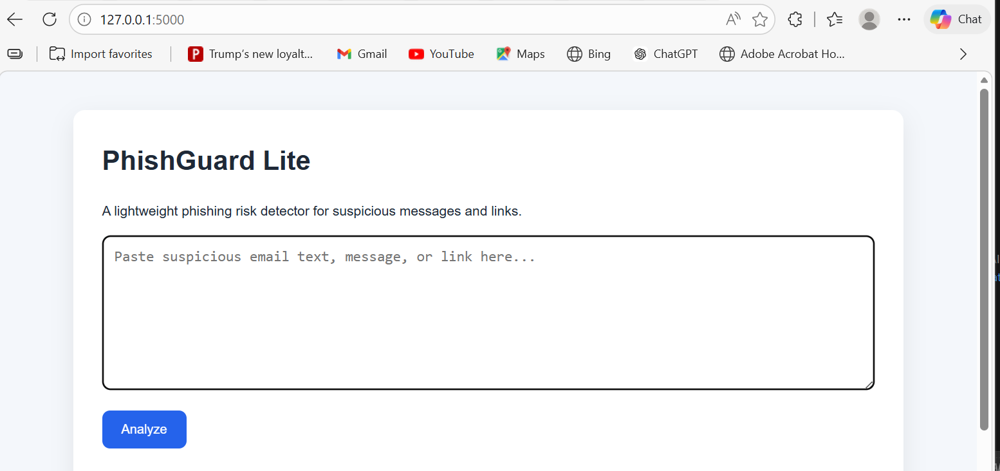

# PhishGuard Lite

## Demo



PhishGuard Lite is a lightweight cybersecurity tool designed to detect phishing attempts in text messages, emails, and suspicious links using rule-based analysis.

---

## Overview

Phishing remains one of the most common attack vectors in modern cybersecurity threats. This project demonstrates how simple, explainable detection techniques can be used to identify suspicious patterns in user-provided text.

The system analyzes input and highlights potential phishing indicators such as urgency, deceptive language, and suspicious URLs, assigning a risk score and classification.

---

## Features

- Rule-based phishing detection
- Risk scoring and classification (Low, Medium, High)
- Detection of suspicious keywords and domains
- Explainable output with identified triggers
- Lightweight Flask-based web interface
- Real-time analysis of user input

---

## How It Works

The detection engine scans input text for known phishing indicators, including:

- Urgent or threatening language
- Account verification requests
- Suspicious or shortened URLs
- Common phishing phrases

Each detected indicator contributes to a cumulative score, which is mapped to a final risk level.

---

## Installation

```bash
python -m venv .venv
.venv\Scripts\activate
pip install -r requirements.txt