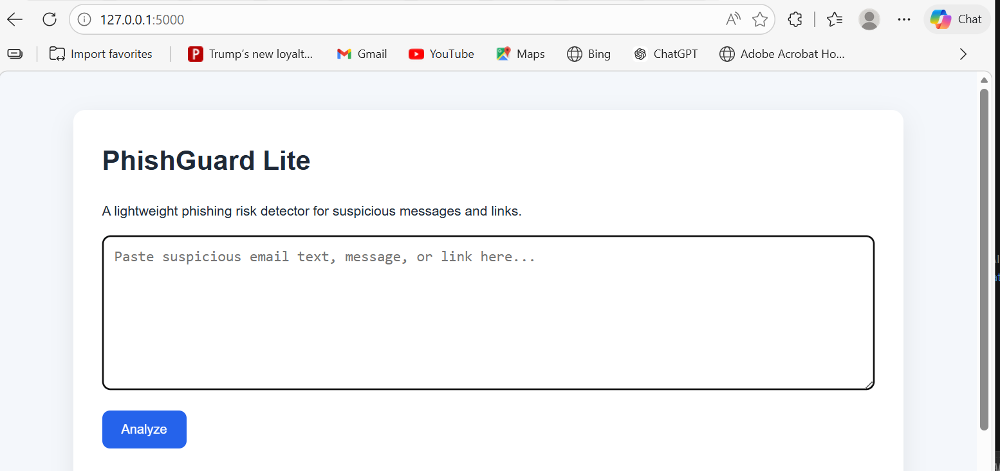
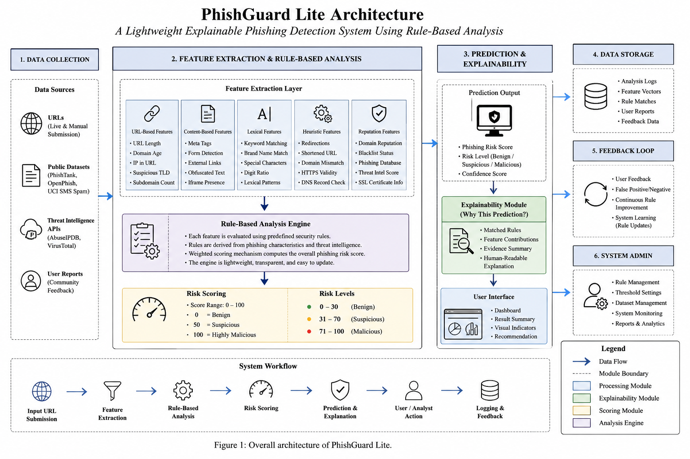

# PhishGuard Lite

A Lightweight Hybrid Explainable Phishing Detection System Using Rule Based Analysis and Machine Learning

---

## Demo



---

## Overview

PhishGuard Lite is a lightweight hybrid phishing detection framework designed to identify suspicious emails, SMS messages, and phishing related text using a combination of rule based analysis and machine learning classification.

The system combines transparent heuristic detection with a TF IDF + Logistic Regression machine learning model to improve phishing detection while maintaining explainability and low computational overhead.

Unlike many black box cybersecurity systems, PhishGuard Lite provides interpretable explanations showing why a message was flagged as suspicious.

---

## Key Features

- Hybrid phishing detection using rule based analysis and machine learning
- Lightweight Logistic Regression phishing classifier
- TF IDF feature extraction pipeline
- Risk scoring and classification
- Explainable detection output
- Detection of suspicious keywords and phishing domains
- Real time Flask web application
- Fast inference suitable for lightweight deployment
- Human interpretable trigger explanations

---

## System Architecture

The system consists of the following major components:

- Input Processing Module
- Rule Based Detection Engine
- TF IDF Feature Extraction Module
- Machine Learning Classification Engine
- Risk Scoring and Fusion Layer
- Explainability Engine
- Flask Web Interface



---

## How It Works

PhishGuard Lite analyzes text messages using two complementary approaches.

### Rule Based Detection

The rule based engine searches for suspicious phishing indicators including:

- Urgency related phrases
- Account verification requests
- Suspicious links
- Credential harvesting patterns
- Social engineering indicators
- Suspicious domains

Each detected trigger contributes to a cumulative phishing risk score.

### Machine Learning Detection

The machine learning module uses:

- TF IDF vectorization
- Logistic Regression classification

The model was trained using the SMS Spam Collection dataset and contributes an additional AI based phishing confidence signal.

### Hybrid Risk Assessment

The final risk level combines:

- Rule based trigger scoring
- AI prediction confidence
- Suspicious link analysis

The system outputs:

- Risk Score
- Risk Level
- Detected Triggers
- AI Prediction
- AI Confidence
- Human readable explanation

---

## Technologies Used

- Python
- Flask
- Scikit learn
- Pandas
- NumPy
- Joblib
- HTML/CSS
- JavaScript

---

## Dataset

The machine learning component of PhishGuard Lite was trained using the publicly available SMS Spam Collection dataset.

Dataset source:

https://archive.ics.uci.edu/dataset/228/sms+spam+collection

The original dataset contains SMS messages labeled as either legitimate messages or spam messages. For this project, the labels were converted into numerical form:

- 0 = legitimate message
- 1 = suspicious or phishing related message

The raw dataset file was placed in:

```text
datasets/raw/SMSSpamCollection

---

## Installation

Clone the repository:

```bash
git clone https://github.com/Brightd4/phishguard-lite.git
cd phishguard-lite

python -m venv .venv
.venv\Scripts\activate

pip install -r requirements.txt

python app.py

---
## How to Use

### 1. Open the Live Demo

Visit the deployed application below:

https://phishguard-lite-2.onrender.com

### 2. Paste a Suspicious Message

Example phishing message:

```text
Urgent action required. Your account has been suspended. Click here to verify your account immediately: http://secure-update-login.com
